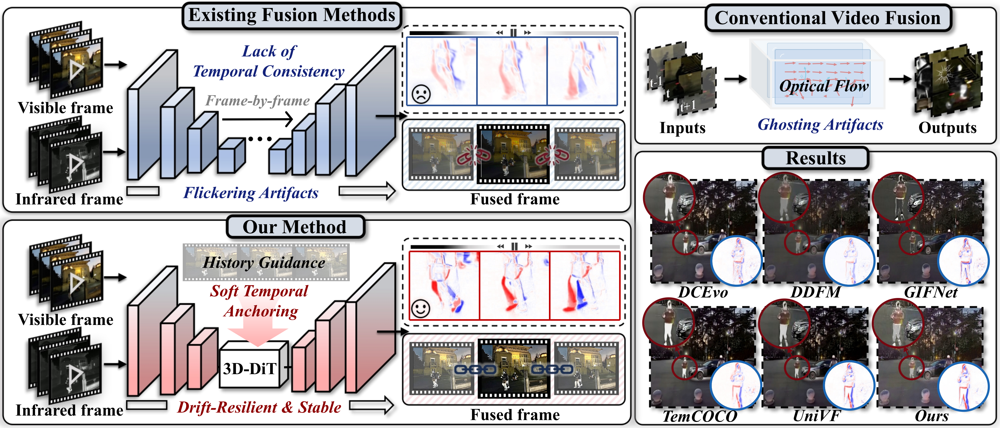
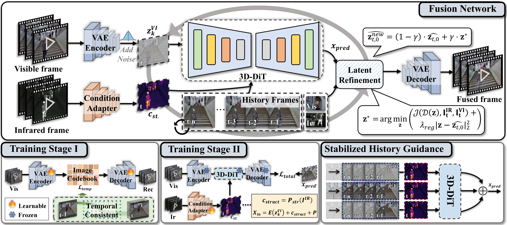

# DRFusion

Official implementation of **DRFusion: Drift-Resilient Temporally Consistent Infrared-Visible Video Fusion**.

Xingyuan Li, Haoyuan Xu, Shulin Li, Xiang Chen, Zhiying Jiang, Jinyuan Liu  
International Conference on Machine Learning (ICML), 2026

Code URL in the paper: `https://github.com/xhhaoyan/DRFusion`

## Overview

DRFusion formulates infrared-visible video fusion as history-conditioned motion generation. The method combines a pretrained video diffusion backbone with a lightweight stage-2 ConditionAdapter, Stabilized History Guidance, Soft Temporal Anchoring, and EM-based latent refinement to improve fusion quality and temporal stability.

The public inference entry in this repository is `test.py`. It always loads the stage-2 adapter checkpoint; the older DiT-only test path is intentionally not used.

## Visual Overview

<p align="center">
  
</p>

<p align="center">
  <b>Figure 1.</b> DRFusion reduces temporal drift and flickering artifacts in infrared-visible video fusion.
</p>

<p align="center">
  
</p>

<p align="center">
  <b>Figure 2.</b> Method pipeline with stabilized history guidance, soft temporal anchoring, and stage-2 structure-motion adaptation.
</p>

## Installation

```bash
git clone https://github.com/xhhaoyan/DRFusion.git
cd DRFusion

conda create -n drfusion python=3.10 -y
conda activate drfusion
pip install -r requirements.txt
```

## Model Zoo

Download the pretrained weights and place them under `checkpoints/`. The VAE and adapter links can be replaced with the final release links when ready; the 3D-DiT backbone points to the upstream DFoT checkpoint.

| Component | File | Description | Download |
| --- | --- | --- | --- |
| Stage-1 VAE | `vae_stage1.ckpt` | Latent encoder/decoder for fusion frames | [Download](https://pan.baidu.com/s/1LYmLFgH_Pfo9rpHxR83zsg?pwd=5bn9) |
| 3D-DiT backbone | `dit_backbone.ckpt` | Upstream DFoT RealEstate10K checkpoint | [Download](https://huggingface.co/kiwhansong/DFoT/resolve/main/pretrained_models/DFoT_RE10K.ckpt) |
| Stage-2 adapter | `adapter_stage2.pt` | DRFusion ConditionAdapter checkpoint | [Download](https://pan.baidu.com/s/1Kzp5IeTtRoW1b_Q_rH9Z_w?pwd=xidd) |

Download the 3D-DiT backbone from the upstream DFoT release and save it with the filename expected by this repository:

```bash
mkdir -p checkpoints
wget -O checkpoints/dit_backbone.ckpt https://huggingface.co/kiwhansong/DFoT/resolve/main/pretrained_models/DFoT_RE10K.ckpt
```

Expected layout:

```text
checkpoints/
  vae_stage1.ckpt
  dit_backbone.ckpt
  adapter_stage2.pt
```

The default inference config is `configs/video_fusion_config.yaml`.

Important fields:

- `autoencoder.ckpt_path`: stage-1 VAE checkpoint.
- `model.pretrained_path`: pretrained 3D-DiT backbone checkpoint.
- `adapter.ckpt_path`: stage-2 ConditionAdapter checkpoint.

## Data Format

For inference, each video folder should contain paired infrared and visible frames:

```text
datasets/VTMOT/
  video_001/
    infrared/
      000001.png
      000002.png
    visible/
      000001.png
      000002.png
```

You may also pass a single folder that directly contains `infrared/` and `visible/`.

## Inference

```bash
python test.py \
  --config configs/video_fusion_config.yaml \
  --video_dir datasets/VTMOT \
  --output_dir outputs/VTMOT
```

## Training

Stage 1 trains the VAE:

```bash
python train_stage1.py -b configs/train_stage1_config.yaml -t --gpus 0,
```

Stage 2 trains the ConditionAdapter while keeping the VAE and 3D-DiT backbone frozen:

```bash
python train_stage2.py \
  --config configs/train_stage2_config.yaml
```

Before training, update dataset paths in the config files:

- `configs/train_stage1_config.yaml`
- `configs/train_stage2_config.yaml`

Then generate local path-list files:

```bash
python data/prepare_path_lists.py \
  --root datasets/train_videos \
  --output_dir data
```

The stage-2 checkpoint will be written to `outputs/adapter_unsupervised/` by default.

## Repository Layout

```text
DRFusion_public/
  test.py                                  # stage-2 adapter inference entry
  drfusion/
    inference.py                          # model loading and video IO
    samplers/adapter_em_sampler.py        # adapter + EM replacement sampler
  video_fusion/                           # 3D-DiT, diffusion, adapter modules
  guided_diffusion/                       # EM refinement utilities
  train_stage1.py                         # stage-1 VAE training
  train_stage2.py                         # stage-2 adapter training
  configs/
```

## Citation

```bibtex
@article{li2026drfusion,
  title={DRFusion: Drift-Resilient Temporally Consistent Infrared-Visible Video Fusion},
  author={Li, Xingyuan and Xu, Haoyuan and Li, Shulin and Chen, Xiang and Jiang, Zhiying and Liu, Jinyuan},
  journal={arXiv preprint arXiv:2605.25775},
  year={2026}
}
```
